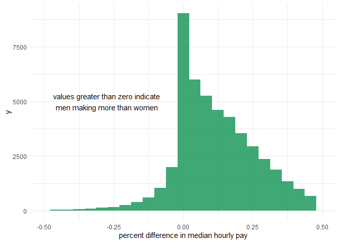
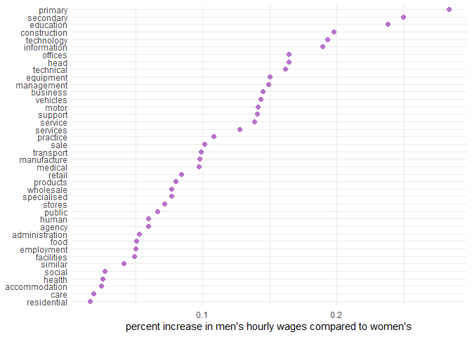
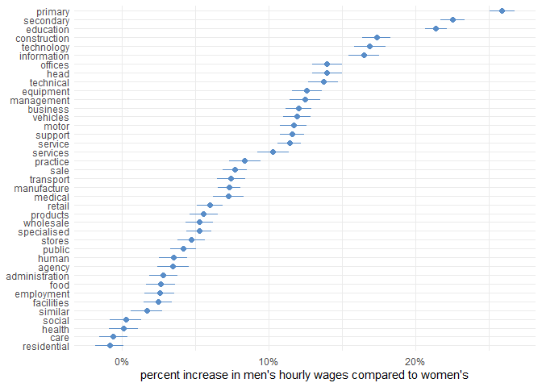
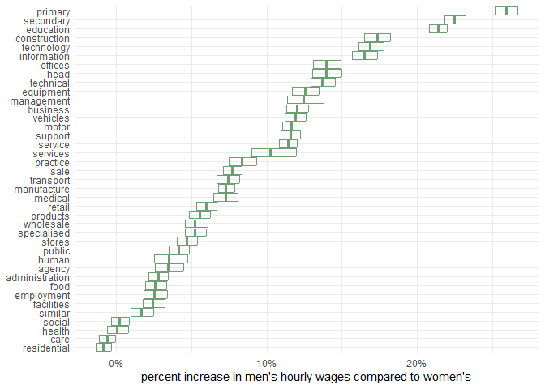

understand the gender pay gap three ways
================
chad allison \| 5 december 2022

following [this tutorial](https://juliasilge.com/blog/pay-gap-uk/) from
Julia Silge

------------------------------------------------------------------------

### loading libraries and setting preferences

``` r
library(tidyverse)
library(tidytext)
library(dotwhisker)
library(rsample)

knitr::opts_chunk$set(message = F, warning = F, fig.align = "center")
options(scipen = 999)
theme_set(theme_minimal())
```

### loading data

``` r
df_raw = read_csv(
  "https://raw.githubusercontent.com/rfordatascience/tidytuesday/master/data/2022/2022-06-28/paygap.csv",
  col_types = cols())

head(df_raw)
```

    ## # A tibble: 6 x 27
    ##   employer_name           employer_id address post_code company_number sic_codes
    ##   <chr>                         <dbl> <chr>   <chr>     <chr>          <chr>    
    ## 1 Bryanston School, Inco~         676 Bryans~ DT11 0PX  00226143       85310    
    ## 2 RED BAND CHEMICAL COMP~       16879 19 Smi~ EH6 8NU   SC016876       47730    
    ## 3 123 EMPLOYEES LTD             17677 34 Rou~ LS7 1AB   10530651       78300    
    ## 4 1610 LIMITED                    682 Trinit~ TA6 3JA   06727055       93110    
    ## 5 1879 EVENTS MANAGEMENT~       17101 The Su~ SR5 1SU   07743495       56210:70~
    ## 6 1LIFE MANAGEMENT SOLUT~         687 Ldh Ho~ PE27 4AA  02566586       93110:93~
    ## # ... with 21 more variables: diff_mean_hourly_percent <dbl>,
    ## #   diff_median_hourly_percent <dbl>, diff_mean_bonus_percent <dbl>,
    ## #   diff_median_bonus_percent <dbl>, male_bonus_percent <dbl>,
    ## #   female_bonus_percent <dbl>, male_lower_quartile <dbl>,
    ## #   female_lower_quartile <dbl>, male_lower_middle_quartile <dbl>,
    ## #   female_lower_middle_quartile <dbl>, male_upper_middle_quartile <dbl>,
    ## #   female_upper_middle_quartile <dbl>, male_top_quartile <dbl>, ...

### counting SIC codes

``` r
df_raw |>
  select(sic_codes) |>
  separate_rows(sic_codes, sep = ":") |>
  count(sic_codes, sort = T) |>
  head(10)
```

    ## # A tibble: 10 x 2
    ##    sic_codes     n
    ##    <chr>     <int>
    ##  1 1          6584
    ##  2 85310      3020
    ##  3 <NA>       2894
    ##  4 82990      2588
    ##  5 85200      2219
    ##  6 84110      1886
    ##  7 70100      1541
    ##  8 86900      1246
    ##  9 78200      1149
    ## 10 86210      1074

### histogram of median difference in hourly pay

``` r
df_raw |>
  ggplot(aes(diff_median_hourly_percent / 100)) +
  geom_histogram(bins = 25, fill = "springgreen4", alpha = 0.75) +
  scale_x_continuous(limits = c(-0.5, 0.5)) +
  labs(x = "percent difference in median hourly pay") +
  annotate("text", x = -0.275, y = 5000,
           label = "values greater than zero indicate\nmen making more than women")
```



### getting more information on the SIC codes

a .csv file of information on the SIC codes can be downloaded at this
link:
<https://www.gov.uk/government/publications/standard-industrial-classification-of-economic-activities-sic>

``` r
sic_codes = read_csv("sic_codes.csv", col_types = cols()) |>
  janitor::clean_names()

sic_codes
```

    ## # A tibble: 731 x 2
    ##    sic_code description                                                     
    ##    <chr>    <chr>                                                           
    ##  1 01110    Growing of cereals (except rice), leguminous crops and oil seeds
    ##  2 01120    Growing of rice                                                 
    ##  3 01130    Growing of vegetables and melons, roots and tubers              
    ##  4 01140    Growing of sugar cane                                           
    ##  5 01150    Growing of tobacco                                              
    ##  6 01160    Growing of fibre crops                                          
    ##  7 01190    Growing of other non-perennial crops                            
    ##  8 01210    Growing of grapes                                               
    ##  9 01220    Growing of tropical and subtropical fruits                      
    ## 10 01230    Growing of citrus fruits                                        
    ## # ... with 721 more rows

### joining SIC codes with original data

``` r
df_joined = df_raw |>
  select(employer_name, diff_median_hourly_percent, sic_codes) |>
  separate_rows(sic_codes, sep = ":") |>
  left_join(sic_codes, by = c("sic_codes" = "sic_code"))

df_joined
```

    ## # A tibble: 71,943 x 4
    ##    employer_name                      diff_median_hourly_~ sic_codes description
    ##    <chr>                                             <dbl> <chr>     <chr>      
    ##  1 Bryanston School, Incorporated                     28.2 85310     General se~
    ##  2 RED BAND CHEMICAL COMPANY, LIMITED                 -2.7 47730     Dispensing~
    ##  3 123 EMPLOYEES LTD                                  36   78300     Human reso~
    ##  4 1610 LIMITED                                      -34   93110     Operation ~
    ##  5 1879 EVENTS MANAGEMENT LIMITED                      8.1 56210     Event cate~
    ##  6 1879 EVENTS MANAGEMENT LIMITED                      8.1 70229     Management~
    ##  7 1LIFE MANAGEMENT SOLUTIONS LIMITED                  2.8 93110     Operation ~
    ##  8 1LIFE MANAGEMENT SOLUTIONS LIMITED                  2.8 93130     Fitness fa~
    ##  9 1LIFE MANAGEMENT SOLUTIONS LIMITED                  2.8 93290     Other amus~
    ## 10 1ST HOME CARE LTD.                                  0   86900     Other huma~
    ## # ... with 71,933 more rows

### tokenizing the code descriptions

``` r
df_token = df_joined |>
  unnest_tokens(word, description) |>
  anti_join(get_stopwords(), by = "word") |>
  na.omit()

df_token
```

    ## # A tibble: 249,545 x 4
    ##    employer_name                      diff_median_hourly_percent sic_codes word 
    ##    <chr>                                                   <dbl> <chr>     <chr>
    ##  1 Bryanston School, Incorporated                           28.2 85310     gene~
    ##  2 Bryanston School, Incorporated                           28.2 85310     seco~
    ##  3 Bryanston School, Incorporated                           28.2 85310     educ~
    ##  4 RED BAND CHEMICAL COMPANY, LIMITED                       -2.7 47730     disp~
    ##  5 RED BAND CHEMICAL COMPANY, LIMITED                       -2.7 47730     chem~
    ##  6 RED BAND CHEMICAL COMPANY, LIMITED                       -2.7 47730     spec~
    ##  7 RED BAND CHEMICAL COMPANY, LIMITED                       -2.7 47730     stor~
    ##  8 123 EMPLOYEES LTD                                        36   78300     human
    ##  9 123 EMPLOYEES LTD                                        36   78300     reso~
    ## 10 123 EMPLOYEES LTD                                        36   78300     prov~
    ## # ... with 249,535 more rows

### filtering to most common words and re-formatting `diff_median_hourly_percent`

``` r
top_words = df_token |>
  count(word) |>
  filter(!word %in% c("activities", "n.e.c", "general", "non")) |>
  slice_max(n, n = 40) |>
  pull(word)

df = df_token |>
  filter(word %in% top_words) |>
  transmute(diff_wage = diff_median_hourly_percent / 100, word)

df
```

    ## # A tibble: 94,381 x 2
    ##    diff_wage word       
    ##        <dbl> <chr>      
    ##  1     0.282 secondary  
    ##  2     0.282 education  
    ##  3    -0.027 specialised
    ##  4    -0.027 stores     
    ##  5     0.36  human      
    ##  6     0.36  management 
    ##  7     0.36  human      
    ##  8    -0.34  facilities 
    ##  9     0.081 management 
    ## 10     0.081 management 
    ## # ... with 94,371 more rows

### visual showing increase in men’s hourly wages compared to women’s for the words in our data

``` r
df |>
  group_by(word) |>
  summarise(diff_wage = mean(diff_wage)) |>
  mutate(word = fct_reorder(word, diff_wage)) |>
  ggplot(aes(diff_wage, word)) +
  geom_point(alpha = 0.9, size = 2, col = "#B165C7") +
  labs(x = "percent increase in men's hourly wages compared to women's",
       y = NULL)
```



### fitting a linear model

``` r
paygap_fit = lm(diff_wage ~ word, data = df)
summary(paygap_fit)
```

    ## 
    ## Call:
    ## lm(formula = diff_wage ~ word, data = df)
    ## 
    ## Residuals:
    ##     Min      1Q  Median      3Q     Max 
    ## -5.1440 -0.0779 -0.0152  0.0795  0.9756 
    ## 
    ## Coefficients:
    ##                     Estimate Std. Error t value             Pr(>|t|)    
    ## (Intercept)         0.024434   0.003449   7.085    0.000000000001396 ***
    ## wordadministration  0.028072   0.004888   5.743    0.000000009313667 ***
    ## wordagency          0.034751   0.005461   6.363    0.000000000198212 ***
    ## wordbusiness        0.120139   0.004436  27.084 < 0.0000000000000002 ***
    ## wordcare           -0.006000   0.004812  -1.247              0.21243    
    ## wordconstruction    0.173407   0.004918  35.259 < 0.0000000000000002 ***
    ## wordeducation       0.213866   0.003813  56.084 < 0.0000000000000002 ***
    ## wordemployment      0.025571   0.005144   4.971    0.000000666033716 ***
    ## wordequipment       0.125896   0.005129  24.545 < 0.0000000000000002 ***
    ## wordfacilities      0.024491   0.004875   5.024    0.000000507243924 ***
    ## wordfood            0.026183   0.005091   5.143    0.000000271046505 ***
    ## wordhead            0.139581   0.005167  27.016 < 0.0000000000000002 ***
    ## wordhealth          0.000780   0.005018   0.155              0.87647    
    ## wordhuman           0.035015   0.004908   7.134    0.000000000000981 ***
    ## wordinformation     0.164731   0.005394  30.541 < 0.0000000000000002 ***
    ## wordmanagement      0.124613   0.005236  23.798 < 0.0000000000000002 ***
    ## wordmanufacture     0.073116   0.003962  18.453 < 0.0000000000000002 ***
    ## wordmedical         0.072566   0.005295  13.705 < 0.0000000000000002 ***
    ## wordmotor           0.116761   0.004541  25.713 < 0.0000000000000002 ***
    ## wordoffices         0.139581   0.005167  27.016 < 0.0000000000000002 ***
    ## wordpractice        0.083639   0.005490  15.235 < 0.0000000000000002 ***
    ## wordprimary         0.259037   0.004414  58.680 < 0.0000000000000002 ***
    ## wordproducts        0.055592   0.004981  11.160 < 0.0000000000000002 ***
    ## wordpublic          0.041621   0.004607   9.034 < 0.0000000000000002 ***
    ## wordresidential    -0.008512   0.004881  -1.744              0.08119 .  
    ## wordretail          0.059842   0.004436  13.491 < 0.0000000000000002 ***
    ## wordsale            0.076940   0.004214  18.260 < 0.0000000000000002 ***
    ## wordsecondary       0.224993   0.004210  53.441 < 0.0000000000000002 ***
    ## wordservice         0.114134   0.004065  28.074 < 0.0000000000000002 ***
    ## wordservices        0.102929   0.005495  18.731 < 0.0000000000000002 ***
    ## wordsimilar         0.016685   0.005489   3.040              0.00237 ** 
    ## wordsocial          0.002359   0.005461   0.432              0.66581    
    ## wordspecialised     0.052442   0.004385  11.959 < 0.0000000000000002 ***
    ## wordstores          0.047102   0.004705  10.012 < 0.0000000000000002 ***
    ## wordsupport         0.115962   0.004288  27.045 < 0.0000000000000002 ***
    ## wordtechnical       0.137053   0.005259  26.062 < 0.0000000000000002 ***
    ## wordtechnology      0.168767   0.005539  30.469 < 0.0000000000000002 ***
    ## wordtransport       0.074288   0.004816  15.425 < 0.0000000000000002 ***
    ## wordvehicles        0.119011   0.004749  25.059 < 0.0000000000000002 ***
    ## wordwholesale       0.052509   0.004700  11.172 < 0.0000000000000002 ***
    ## ---
    ## Signif. codes:  0 '***' 0.001 '**' 0.01 '*' 0.05 '.' 0.1 ' ' 1
    ## 
    ## Residual standard error: 0.151 on 94341 degrees of freedom
    ## Multiple R-squared:  0.1827, Adjusted R-squared:  0.1824 
    ## F-statistic: 540.8 on 39 and 94341 DF,  p-value: < 0.00000000000000022

### visualising model results using `dotwhisker` package

``` r
tidy(paygap_fit) |>
  mutate(term = str_remove(term, "word"),
         term = fct_reorder(term, -estimate)) %>% # this has to be %>% not |>
  dwplot(vars_order = levels(.$term),
         dot_args = list(size = 2, col = "#598DC8"),
         whisker_args = list(col = "#598DC8")) +
  scale_x_continuous(labels = scales::percent) +
  labs(x = "percent increase in men's hourly wages compared to women's",
       y = NULL)
```



### fitting many models

``` r
paygap_intervals = reg_intervals(diff_wage ~ word, data = df)

paygap_intervals
```

    ## # A tibble: 39 x 6
    ##    term                .lower .estimate    .upper .alpha .method  
    ##    <chr>                <dbl>     <dbl>     <dbl>  <dbl> <chr>    
    ##  1 wordadministration  0.0216   0.0279   0.0345     0.05 student-t
    ##  2 wordagency          0.0258   0.0343   0.0448     0.05 student-t
    ##  3 wordbusiness        0.113    0.120    0.128      0.05 student-t
    ##  4 wordcare           -0.0113  -0.00617 -0.000741   0.05 student-t
    ##  5 wordconstruction    0.165    0.173    0.182      0.05 student-t
    ##  6 wordeducation       0.208    0.214    0.220      0.05 student-t
    ##  7 wordemployment      0.0182   0.0253   0.0339     0.05 student-t
    ##  8 wordequipment       0.117    0.126    0.135      0.05 student-t
    ##  9 wordfacilities      0.0178   0.0242   0.0321     0.05 student-t
    ## 10 wordfood            0.0195   0.0259   0.0335     0.05 student-t
    ## # ... with 29 more rows

### visualising modeling results

``` r
paygap_intervals |>
  mutate(term = str_remove(term, "word"),
         term = fct_reorder(term, .estimate)) |>
  ggplot(aes(.estimate, term)) +
  geom_crossbar(aes(xmin = .lower, xmax = .upper),
                col = "#6C9E72", alpha = 0.75) +
  scale_x_continuous(labels = scales::percent) +
  labs(x = "percent increase in men's hourly wages compared to women's",
       y = NULL)
```


